# Clark County Election Analysis

## About Clark County

Clark County is the most populous county in Nevada according to the U.S. Census Bureau. It is home to approximately 70% of the state's population and includes world-famous Las Vegas.

Of the 2.3 million residents, about 1.5 million are registered to vote. This includes approximately 485,000 registered Democrats, around 393,000 registered Republicans, and a combined total of about 646,000 voters registered with third parties or with no party affiliation.

## Key Findings
Using the Cast Vote Record (“CVR”) data for Clark County, the Election Truth Alliance (ETA) has identified voting pattern anomalies of significant concern. Our analysis uncovers unusual phenomena in the Early Voting results not present in Election Day voting or Mail-In Voting results.

- Drop-Off Difference: The term "drop-off votes" refers to the votes cast for a presidential candidate versus the votes cast for a down-ballot candidate of the same party. In Clark County, as was the case across the swing states in the 2024 U.S. Presidential Election, there is a significant difference between Trump’s drop-off rate (+10.54%) and Harris’s drop-off rate (+1.07%).

- Increased Volume of Votes Linked to Greater Discrepancies: The greater number of ballots cast and processed in Early Voting, the more Trump’s vote count increased while Harris’s vote count decreased. The pattern is more distinct (closer to 60% votes for Trump, closer to 40% votes for Harris) with more ballots processed by a given tabulator.

- Abnormal Clustering: In contrast to Election Day voting, Early Vote results display an unusual pattern: once approximately 250 ballots have been processed a visible shift is observed, resulting in a high degree of clustering and unusual uniformity. This is a departure from expected human voting behavior. 

<div style="width: 100%; display: inline-block;">
  <div style="width: 50%; float: left;">
    <div style="font-size: large">
      Clark County in Maps:
    </div>
    1. Nevada counties, with Clark County location in red. Source: Ballotpedia<br>
    2. Nevada counties by population density, 2016. Source:  Maps of World<br>
    3. Nevada with cities, towns, and roads pictured. Source: Alamy Images<br>
  </div>
  <div style="width: 50%; float: right;">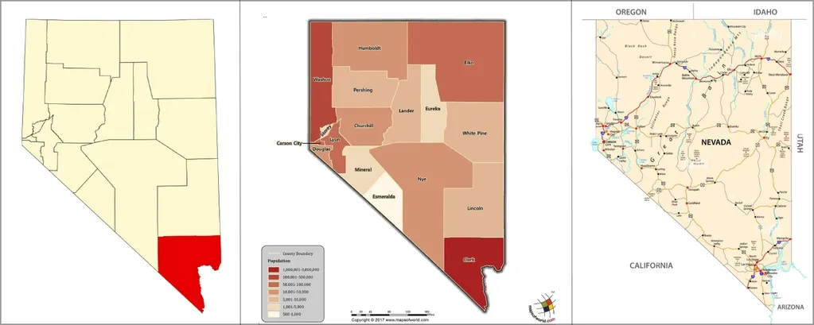</div>
</div>
<br>

### 1.1 Ballots Cast
According to Clark County CVR data, a total of 1,033,285 votes were cast in Clark County across the three types of 
voting: mail-in, early voting, and Election Day voting. Statewide, the total number of votes cast in Nevada was 1,484,840.

- <b>Mail-In Voters (443,823 total):</b>
  - Harris received 61% of recorded presidential votes (271,455 votes)
  - Trump received 36% of recorded presidential votes (160,824 vote)
- <b>Early Voters (395,438 total):</b>
  - Harris received 40% of recorded presidential votes (156,705 votes)
  - Trump received 59% of recorded presidential votes (234,231)
- <b>Election Day Voters (194,024 total):</b>
  - Harris received 47% of recorded presidential votes (91,831 votes)
  - Trump received 50% of recorded presidential votes (97,662 votes)

### 1.2 Data Analysis
The analysis stems from CVR data Clark County posted on its [website](https://www.clarkcountynv.gov/). This data is 
publicly available for download. [Links](https://www.clarkcountynv.gov/government/departments/elections/reports_data_maps/index.php) 
and [archived links](https://web.archive.org/web/20241228080438/https://elections.clarkcountynv.gov/electionresultsTV/cvr/24G/24G_CVRExport_NOV_Final_Confidential.zip).

CVR data is significant because it shows, on a ballot-by-ballot basis, how votes in Clark County were recorded. It notes 
whether ballots were cast as Mail-In Votes, Early Votes, or Election Day votes. (Provisional ballots are not included.) 
Notably, Clark County CVR data shows the numbers associated with a given tabulation machine, labeled ```TabulatorNum```, 
including how many ballots were processed. All mail-in ballots were tabulated by 6 machines.

### 2. Drop-Off Vote Comparison
The term "drop-off votes" refer to the votes cast for a presidential candidate versus the votes cast for a down-ballot 
candidate of the same party. The term highlights the number of voters who voted for president but skipped voting in lower 
races, like the Senate or House races.

In our analysis of Clark County, the drop-off rate is measured between votes for the Presidential race and the Nevada 
Senate race, which had Jacky Rosen (D) running against Sam Brown (R). The drop-off rate is calculated by finding the 
difference between the number of votes cast for president and the votes cast for the Senate race, and then dividing 
this by the total number of presidential votes for each party.

While some drop-off between the presidential and down-ballot races is expected, SMART Elections – a non-partisan group 
focused on election security – notes that in the 2024 U.S. Presidential Election, drop-off rates were very different 
on the Republican versus the Democratic side. Drop-off rates for the Republican side were very high, whereas the 
drop-off rates for the Democratic side were quite low or even into the negative.

They also found that drop-off rates in swing states tend to be significantly higher compared to non-swing states. This 
aligns with findings from other independent analysts who examined voting patterns in similar regions.

There are several possible explanations for a difference in drop-off rates, including:

- Differential between popularity of candidates at the top of the ticket versus down-ballot candidates
- “Split ticket” voting, where a voter casts a ballot for candidates of multiple parties
- Targeted political messaging directed uniquely towards swing states.

To date, the Election Truth Alliance’s analysis has not focused heavily on drop-off rates. Like most swing states, Nevada 
shows a disparity between Trump and Harris’s drop-off rates: +9.87% for Trump, and +0.58% for Harris.

The Clark County CVR data allows a closer examination of drop-off votes by voting type: Mail-In, Early Votes, and 
Election Day. It has enabled us to “lift the hood” and look more closely at:

- How drop-off votes break down by voting type in that county
- Any insights into what potential causes of the drop-off disparity may stand up to closer inspection.

The breakdown of Clark County drop-off votes by voting type is below:

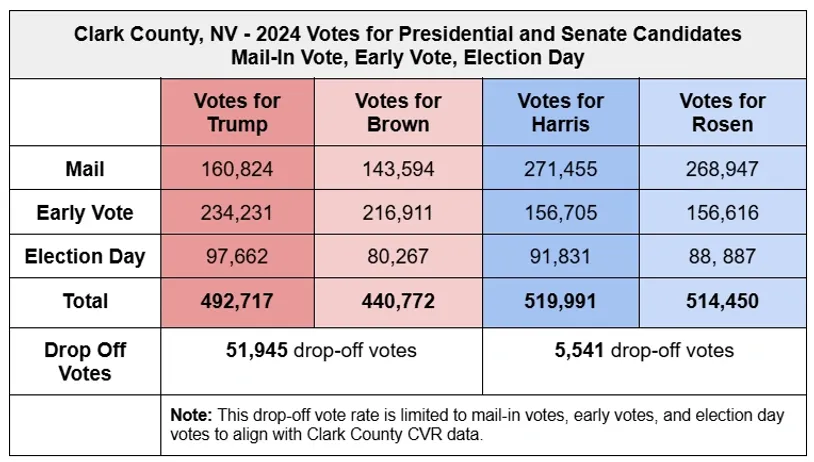

When broken down by voting type, we see that there is an especially narrow margin between votes for Harris vs Rosen 
in the Early Voting data – only 89 votes compared to thousands for the other voting types.

This prompted us to look more closely at the potential differences between the different voting types through a variety 
of analytic lenses.

### 3. Early Votes and Election Day Votes - In Charts
There are notable differences in voting data patterns across the three types of voting data available in Clark County’s 
Cast Vote Record.

To some extent, this voting pattern is expected: there are differences in the populations who tend to vote using these 
different methods. However, there are patterns in the Early Votes as recorded that deviate significantly from organic 
human voting behavior.

Human behavior is messy – including when we vote.  This scatterplot represents the variation that is expected from a 
large population. In the Election Day voting results, we see an expected degree of human voting behavior reflected

<div style="width: 100%; display: inline-block; background-color: #f4f4f4; border-top: 40px solid #f4f4f4; border-bottom: 40px solid #f4f4f4;">
  <div style="width: 50%; float: left;">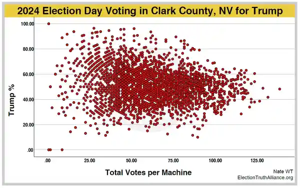</div>
  <div style="width: 50%; float: right;">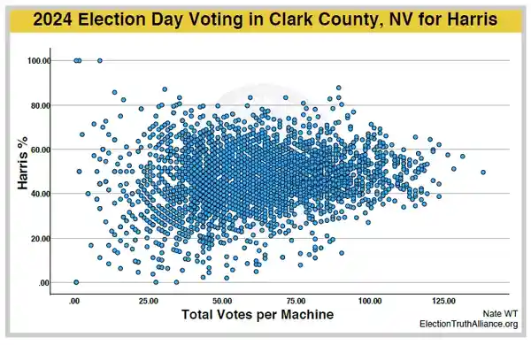</div>
</div>

**<span style="color: red; font-size: 1.2em;">In contrast to Election Day voting, Early Vote results display an unusual pattern</span>**
<br><br>

<div style="width: 100%; display: inline-block; background-color: #f4f4f4; border-top: 40px solid #f4f4f4; border-bottom: 40px solid #f4f4f4;">
  <div style="width: 50%; float: left;">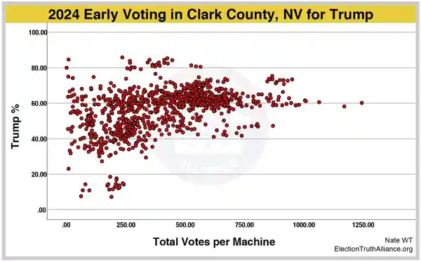</div>
  <div style="width: 50%; float: right;">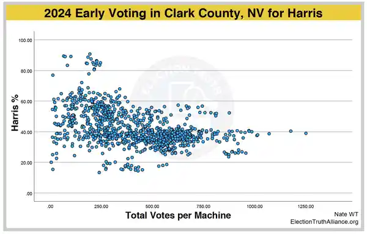</div>
</div>

Expected randomness in the Early Voting results are observed **until approximately 250 ballots have been processed. 
Beyond that range, a visible shift is observed** once the number of ballots processed exceeds the threshold, resulting 
in a **high degree of clustering and unusual uniformity**, a departure from expected human voting behavior. The pattern 
is more distinct (closer to 60% votes for Trump, closer to 40% votes for Harris) with more ballots processed by a given 
voting machine.

Rather than an expected distribution of votes, similar to Election Day votes, the Early Voting data suggests there may 
be a correlation between the quantity of ballots processed and the overall candidate vote percentage.

<div style="width: 100%; display: inline-block; horiz-align: center;">
  <div style="width: 100%; display: inline-block; text-align: center; background-color: #f4f4f4; border-top: 40px solid #f4f4f4; border-bottom: 40px solid #f4f4f4;">
    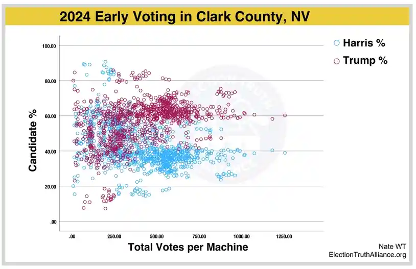
  </div>
</div>

Curiously, a less pronounced version of similar clustering appears in Clark County 2020 Early Voting data; however, the 
<i>skew</i> does not become visible until a higher vote threshold (approximately 600 votes) is met. As a result, the 
clustering and resulting ‘gap’ is less pronounced.

<div style="width: 100%; display: inline-block; background-color: #f4f4f4; border-top: 40px solid #f4f4f4; border-bottom: 40px solid #f4f4f4;">
  <div style="width: 50%; float: left;">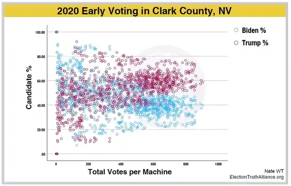</div>
  <div style="width: 50%; float: right;"></div>
</div>
<br><br><br>

<div style="width: 100%; display: inline-block; background-color: #f4f4f4; border-top: 40px solid #f4f4f4; border-bottom: 40px solid #f4f4f4;">
  <div style="width: 50%; float: left;">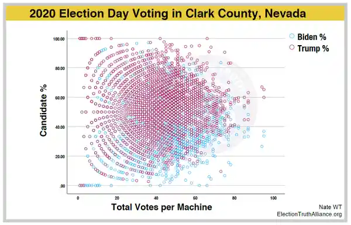</div>
  <div style="width: 50%; float: right;"></div>
</div>

### Summary:
- After approximately 250 early voting ballots were processed by a voting machine, a shift is observed in the reported voting patterns;
- Instead of a chaotic, expected distribution, the vote percentages start to shift more heavily in Trump’s favor;
- This pattern is not found in Election Day votes.

The ‘scatterplot’ above is useful in identifying this phenomenon; however, the format makes it difficult to see how the 
“occurrences” (the individual circles representing each voting machine) are distributed among the two presidential 
candidates – meaning:

- Each voting machine processed ballots and calculated what percentage of those ballots a presidential candidate won. 
(The percentage range of cast/processed ballots is the horizontal **x-axis**.)
- We show the number of tabulators (100, 200, 300). (This is the vertical **y-axis**.)
- The colored bars represent how many voting machines produced a result; showing a candidate (blue or red) receiving an approximate percentage of total votes.

Grouping the results this way, we would expect to see something close to a normal bell curve. Normal data that is not manipulated and follows natural variability tends form a bell curve, or normal distribution.

This is the result we observe for votes cast for presidential candidates on Election Day:

<div style="width: 100%; display: inline-block; background-color: #f4f4f4; border-top: 40px solid #f4f4f4; border-bottom: 40px solid #f4f4f4;">
  <div style="width: 50%; float: left;">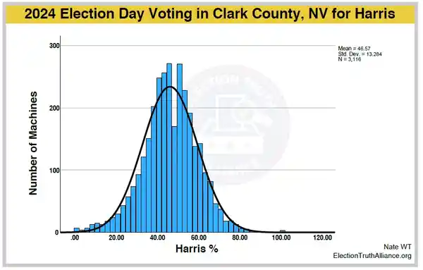</div>
  <div style="width: 50%; float: right;">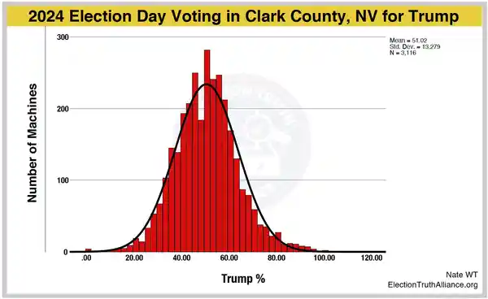</div>
</div>

With Election Day votes, the results for both candidates aligns with normal distribution – it largely follows the 
bell curve.

With Early Votes, however, **there is an inexplicable shift**:

<div style="width: 100%; display: inline-block; background-color: #f4f4f4; border-top: 40px solid #f4f4f4; border-bottom: 40px solid #f4f4f4;">
  <div style="width: 50%; float: left;">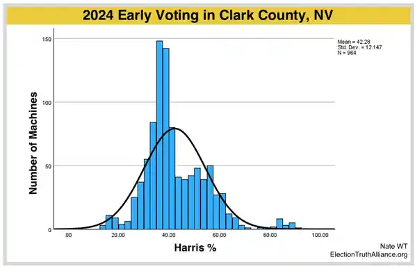</div>
  <div style="width: 50%; float: right;">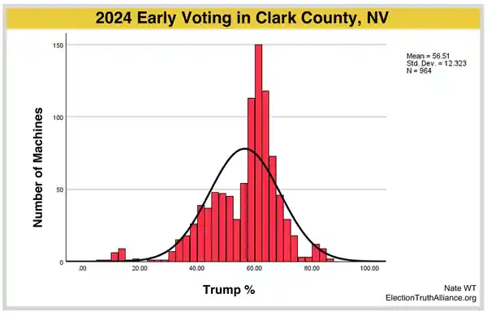</div>
</div>

In particular, note the sharp increase in the number of tabulators that show Trump receiving around 60% of the vote – 
the tall red bars that fall outside of normal distribution.

The pattern above shows an inexplicable spike in vote distribution that is **statistically unlikely based on typical 
human voting behavior**. It also resembles a phenomenon referred to as a 
“[Russian Tail](https://web.archive.org/web/20250218234821/https://www.rferl.org/a/georgia-election-manipulation-russian-tail/33183374.html)”, 
where an anomalous deviation from normal distribution can be an indicator of unfair elections. Such a ‘spike’ may 
indicate election result falsification, particularly if only one candidate appears to benefit. More information 
about voter turnout relative to county/precinct and additional analysis may be needed in order to definitively confirm 
the presence of this phenomenon in Clark County Early Voting results.

The Russian Tail has appeared in elections wherein Russian election manipulation is suspected. Recently, it has been 
[cited](https://web.archive.org/web/20250216022436/https://www.rferl.org/a/georgia-election-manipulation-russian-tail/33183374.html)
as evidence of Russian meddling in the 2024 Georgian parliamentary elections.

#### What Could Cause This Trend in Early Voting?

<u><i>“Deep Red” Areas Theory</i></u>
- Clark County voters may vote early at any Early Voting location. This is similar to Election Day, where 
“Election Day vote centers” have replaced assigned polling stations.
- For example, if you are a Clark County resident you can cast your ballot at a polling station near home, work, 
or any location in between. A spatial depiction of polling locations in Nevada can be found 
[here](https://web.archive.org/web/20250125042048/https://nvsos.maps.arcgis.com/apps/dashboards/34ab096808b44d479b18cb0e59f519e7) 
on the Secretary of State website.
- While such a deviation in the data could potentially still emerge, **this does not explain why the pattern is 
limited to Early Voting**, as in that scenario it would be reasonable to expect the same deviation to appear in 
Election Day results. Instead, Election Day results indicate a normal, expected variation.
* The clustering represented in the Early Voting data still appears unusually severe.

<ul><i>Data Suggestive of Vote Manipulation:</i></ul>

- In the absence of hand recounts or other investigative measures, the ‘artificial-looking’ gap and heavy skew in 
the Clark County Early Voting Data is concerning.
- There is a common misconception among the American electorate - promoted or contested at times by political 
parties - that the country’s elections are “secure.” Cybersecurity and election security experts have confirmed 
that this is **far from accurate**.
  - On November 13, 2024, a group of election and cybersecurity experts contacted Kamala Harris urging her to 
  initiate hand recounts of paper ballots in key swing states.
  - Their concern stemmed from multiple election security breaches that occurred between 2020 and 2024, involving 
  Election Systems & Software (“ES&S”) and Dominion Voting Systems machines, in which “software for the central 
  servers, tabulators, and highly restricted election databases” for both voting system vendors was compromised 
  over a multi-year period. These experts say this was “**the most severe election security breach publicly known**”.
  - The Nevada Secretary of State website lists voting systems in use in the state 
  [here](https://www.nvsos.gov/sos/elections/election-resources/voting-system). The list prominently features 
  both ES&S and Dominion voting systems.
- While Nevada does conduct risk-limiting audits, these cybersecurity and election security experts stated that 
in “most states the audits are insufficiently rigorous” to ensure any potential errors in tabulation will be caught 
and corrected. Worryingly,  the experts **emphatically** state that such safeguards **do nothing to protect** <i>the 
integrity of the ballots</i> **in cases of “security breaches that have occurred”**.
  - According to Nevada's [risk-limiting audit report](https://web.archive.org/web/20250129191416/https://www.nvsos.gov/sos/home/showpublisheddocument/15625/638682082174300000), 
  published November 20, 2024, by the Nevada Secretary of State, a total of 220 ballots in the state were audited 
  using a ballot comparison method. Though in alignment with procedures for this type of audit, that represents 0.01% 
  of Nevada ballots.

#### Our Questions:

The publicly available Clark County data is a helpful tool to support transparency and independent validation of 
election results. Since the 2024 election, most counties have not published data with the same level of detail.

Despite access to high-quality data, more questions remain.

1. What is the connection between "Tabulator Numbers" and geographic locations? Were the voting machines associated 
with one or more particular county-wide polling places?
1. Is there a connection between the geographic location of voting machines and historical political leanings, i.e., 
were certain devices located in areas known to skew red?
1. It appears that devices with lower serial numbers collected more ballots than devices with higher serial numbers. 
Why? Is there a reason for this?
1. Is there any other explanation for the non-organic clustering and skewing that appears in the Early Voting data, 
such as some kind of error or malfunction? If so, is there a reason why such an error was not caught or identified 
in routine pre- or post-election systems integrity tests?


#### Our Next Steps

Truth matters, and confidence in the integrity of elections is paramount to a functional democracy. The ETA intends to take the following actions:

- ***Share our findings*** with local media outlets, politicians, and experts in Nevada. We are particularly 
interested in the opinion and insights from Jon Ralston of the Nevada Independent, whose November 4, 2024 article characterized the 2024 Nevada Early Vote as “different from any since this data was kept in such detail”.
- ***Seek additional review***, interrogation, and corroboration of our analysis.
- Reach out directly to Clark County and the Nevada Secretary of State to request the opportunity to seek clarification 
on outstanding questions, discuss our findings, and express the seriousness of our concerns.
  - We also intend to strongly urge for investigative steps and hand recounts to advance our shared objectives of ensuring the vote of every eligible Nevadan is counted fairly, and reinforcing confidence in the results of Nevada elections.

If the cost associated with investigative measures and/or hand recounts is prohibitive, the ETA is willing to discuss 
potential cost-sharing agreements.

### Sources and Attribution:

***Cast Vote Record (2024) from Clark County Website***<br>
Clark County Website. "Cast Vote Record (2024)." Records, Data, Maps. Archived Version. <br>
https://www.clarkcountynv.gov/government/departments/elections/reports_data_maps/index.php (archived) <br>
https://elections.clarkcountynv.gov/electionresultsTV/cvr/24G/24G_CVRExport_NOV_Final_Confidential.zip (archived)

***Clark County Website. "Early Voting Locations."***<br>
https://www.clarkcountynv.gov/government/elections/early_voting.php (archived)

***FreeSpeechForPeople Letter***<br>
FreeSpeechForPeople. "Computer Scientists: Breaches of Voting System Software Warrant Recounts to Ensure Election Verification." Letter dated November 13, 2024. FreeSpeechForPeople. https://freespeechforpeople.org/wp-content/uploads/2024/11/letter-to-vp-harris-111324-1.pdf  (archived)

***Nevada Independent Article***<br>
Ralston, Jon. "Editor Jon Ralston’s 2024 Nevada Election Predictions." Nevada Independent, November 4, 2024.<br>
https://www.nevadaindependent.com/article/2024-election-predictions

***Nevada Secretary of State Website***<br>
Nevada Secretary of State Website. "Elections - Voting Systems." Nevada Secretary of State. https://www.nvsos.gov/sos/elections/election-resources/voting-system (archived)

***Nevada Secretary of State Website (Polling Places)***<br>
Nevada Secretary of State Website. "Spatial Data - Polling Places." Nevada Secretary of State. https://nvsos.maps.arcgis.com/apps/dashboards/34ab096808b44d479b18cb0e59f519e7 (archive)

***Nevada Secretary of State Website (Risk-Limiting Audit Memorandum).***<br>
https://www.nvsos.gov/sos/home/showpublisheddocument/15625/638682082174300000 (archived)

***SMARTElections Drop-Off Analysis***<br>
SMARTElections Website. “Drop-Off Analysis – 2024 Election.” Smart Elections website. https://smartelections.us/dropoff (archived)

***Russian Tail Article by RadioFree Europe.***<br>
“The Russian Tail: How Data Could Reveal Georgian Election Fraud”. Luka Pertaia, Ivan Gutterman and Wojtek Grojec. Radio Free Europe - Radio Liberty. https://www.rferl.org/a/georgia-election-manipulation-russian-tail/33183374.html (archived)

### Attribution:

Our team of analysts brings a wealth of credentials and expertise across several related fields, including data 
analysis, political science, network security and information systems (cybersecurity), auditing, computer engineering, 
and bioengineering. This diverse set of skills enables us to approach complex problems from multiple perspectives, 
ensuring thorough and well-rounded analyses.
